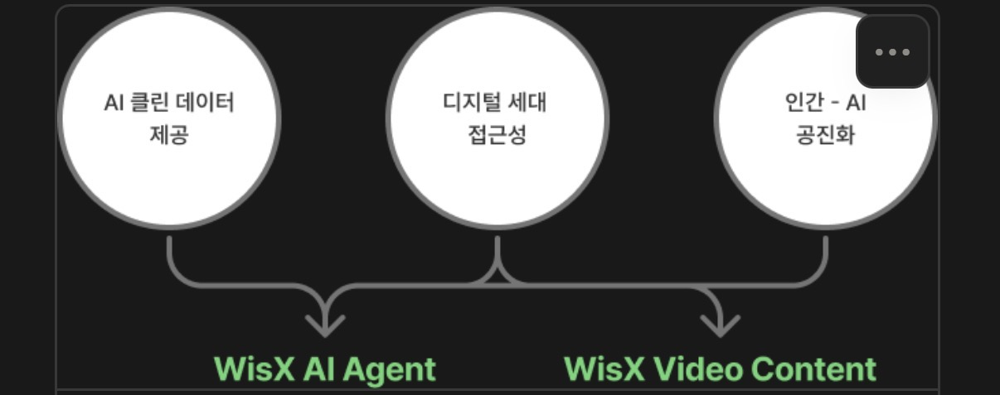

# WisX — 프로젝트 자료

WisX AI 프로젝트 관련 미팅 노트와 비전 자료를 모아둔 폴더.

## 비전 맵

세 가지 핵심 가치가 두 가지 최종 산출물로 연결된다.

| 핵심 가치 | → | 최종 산출물 |
|---|---|---|
| AI 클린 데이터 제공 | | **WisX AI Agent** |
| 디지털 세대 접근성 | | **WisX Video Content** |
| 인간 – AI 공진화 | | |

## 자료

- [`0126-meeting-notes.md`](0126-meeting-notes.md) — 2026-01-26 정기 미팅 노트 (구현 방법 아이디에이션)
- [`assets/vision-map.jpeg`](assets/vision-map.jpeg) — 비전 맵 다이어그램

## 참고 링크

- Figma 보드: https://www.figma.com/board/TUrpcH9ao1Y6kAJA5bwyg6/
- 초원: https://chowon.in/
- Mechanical Buddha (character.ai): https://character.ai/character/Z5WaWtty/mechanical-buddah-cultivation-guide
- 자동 영화 제작 논문 (ICLR2026 리뷰 중): https://openreview.net/pdf/307a103650e4d760b09caf1fac5514a8b0514832.pdf
